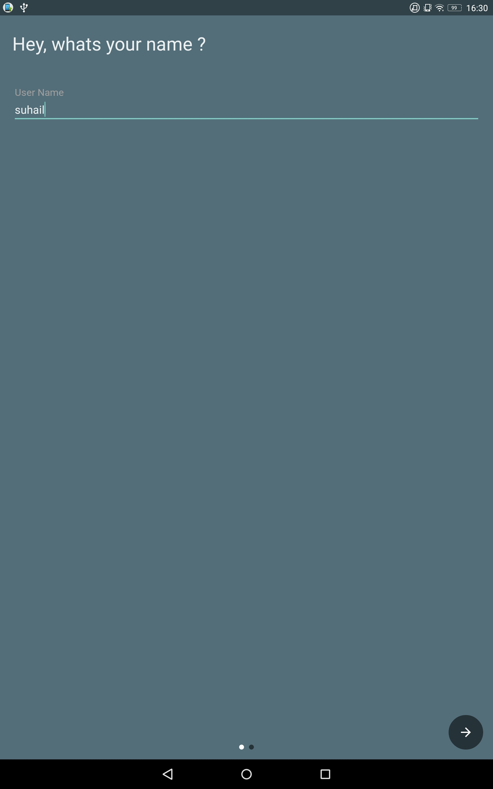

# Android-Weather-App
Basic Android app to extract data from the API and display in the UI.

# Welcome page with <a href="https://github.com/TangoAgency/material-intro-screen">material-intro-screen</a>
The first page asks the users name to greet the user later on in the app.

The second page asks the greets the user depending on the time of the day.

# The Main activiy with the UI
The Main page contains the UI which displays the current location weather information.

The app help section uses <a href="https://github.com/amlcurran/ShowcaseView">Showcase View</a> which navigates through the UI and displays more information.

For more information please do refer the <a href="https://medium.com/@sasude9/basic-android-weather-app-6a7c0855caf4">blog</a> or <a href="https://play.google.com/store/apps/details?id=com.mobileapp.suhailparvez.weather">download it</a> from the Play store.

# Privacy Policy

<a href="https://github.com/suhail09">suhail09</a> built the Android Weather App app as a Free app. This SERVICE is provided by suhail09 at no cost and is intended for use as is.

This page is used to inform website visitors regarding my policies with the collection, use, and disclosure of Personal Information if anyone decided to use my Service.

If you choose to use my Service, then you agree to the collection and use of information in relation to this policy. The Personal Information that I collect is used for providing and improving the Service. I will not use or share your information with anyone except as described in this Privacy Policy.

The terms used in this Privacy Policy have the same meanings as in our Terms and Conditions, which is accessible at Android Weather App unless otherwise defined in this Privacy Policy.

# Information Collection and Use

For a better experience, while using our Service, I may require you to provide us with certain personally identifiable information. The information that I request is retained on your device and is not collected by me in any way

The app does not third party services that may collect information used to identify you.

Accessing Location - The app accesses user's location to display the current location weather information only. The location details are not stored are shared to any third party.

# Children's Privacy

These Services do not address anyone under the age of 13. I do not knowingly collect personally identifiable information from children under 13. 

# Changes to This Privacy Policy

I may update our Privacy Policy from time to time. Thus, you are advised to review this page periodically for any changes. I will notify you of any changes by posting the new Privacy Policy on this page. These changes are effective immediately after they are posted on this page.

# Contact Us

If you have any questions or suggestions about my Privacy Policy, do not hesitate to contact me.

